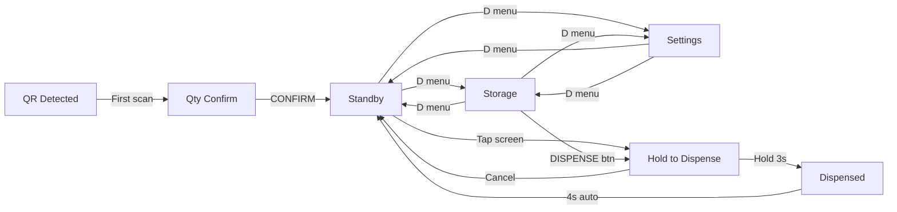

# DOSE Home Station — Screen Workflow

Full screen-by-screen reference for designing the DOSE Home Station UI.

> **Display:** 800 x 480 px | **Hardware:** Elecrow 5" Touchscreen on Raspberry Pi 4B  
> **Font:** Nunito (primary), DejaVu Sans (fallback) | **Renderer:** Tkinter fullscreen kiosk

Open **WORKFLOW.html** for the visual mockups with exact pixel coordinates.

---

## Application Flow



---

## Color Palette

| Slot   | Hex       | Usage                    |
|--------|-----------|--------------------------|
| Blue   | `#5B9BFF` | Slot 0 accent, top row   |
| Red    | `#FF6B6B` | Slot 1 accent            |
| Green  | `#5BD08A` | Slot 2 accent            |
| Yellow | `#E6C34A` | Slot 3 accent, bottom    |

### Dark Theme (default)
| Token     | Hex       | Usage             |
|-----------|-----------|-------------------|
| bg        | `#070708` | Screen background |
| fg        | `#F4F4F2` | Primary text      |
| muted     | `#7E8186` | Secondary text    |
| card_bg   | `#141418` | Card backgrounds  |
| btn_bg    | `#1E1E24` | Button background |
| btn_active| `#2A2A32` | Button pressed    |
| popup_bg  | `#1A1A20` | Popup menu bg     |

### Light Theme
| Token     | Hex       |
|-----------|-----------|
| bg        | `#F4F4F2` |
| fg        | `#1A1A1C` |
| muted     | `#888888` |
| card_bg   | `#E8E8E6` |
| btn_bg    | `#DCDCDA` |
| btn_active| `#D0D0CE` |
| popup_bg  | `#E0E0DE` |

---

## Screen 1: Standby (S-01, S-02)

Default home screen. Shows clock + today's medication schedule.

**Key rule:** Only pills whose QR code is currently visible to the camera (seen within 15 seconds) appear in the schedule.

### Layout
```
┌──────────────────────────────────────────────────────────────────┐
│  9:30 AM                                              WiFi ···  │  y=20
│                                                                  │
│  TODAY'S SCHEDULE                                                │  y=80
│                                                                  │
│  ┌─────────────────────────────────────────────────────────────┐ │  y=108
│  │█ 8:00 AM                                        28 pills   │ │  620x72
│  │█ Sertraline                                                 │ │
│  └─────────────────────────────────────────────────────────────┘ │
│  ┌─────────────────────────────────────────────────────────────┐ │  y=190
│  │█ 12:00 PM                                       14 pills   │ │
│  │█ Ibuprofen                                                  │ │
│  └─────────────────────────────────────────────────────────────┘ │
│  ┌─────────────────────────────────────────────────────────────┐ │  y=272
│  │█ 6:00 PM                                        30 pills   │ │
│  │█ Vitamin D                                                  │ │
│  └─────────────────────────────────────────────────────────────┘ │
│                                                                  │
│                                                          ┌────┐ │
│                                                          │ D  │ │  80x80
│                                                          └────┘ │
└──────────────────────────────────────────────────────────────────┘
 800 x 480
```

### Elements
- **Clock:** x=52, y=20, font 32px
- **"TODAY'S SCHEDULE":** x=52, y=80, font 11px bold uppercase, letter-spacing 0.1em, color muted
- **Schedule cards:** x=52, y=108 + i*82, each 620w x 72h
  - 5px color bar on left (slot accent)
  - Time: pad-left 20, pad-top 8, font 24px bold
  - Name: pad-left 20, pad-top 40, font 14px, color muted
  - Count: x=480, pad-top 20, font 20px bold, slot accent color
- **D Logo:** 80x80, bottom-right at (710, 390)
- **Empty state:** "Place medications in view to see schedule" at x=52, y=200

### Interaction
- Tap anywhere on screen → Hold to Dispense (first pill in view with count > 0)
- Tap D logo → popup menu

---

## Screen 2: Storage (ST-01, ST-02, ST-03)

Split panel. Left: vertical pill list. Right: detail + schedule editor.

**Key rule:** Only pills whose QR is in camera view appear in the list.

### Layout
```
┌────────────────────┬─────────────────────────────────────────────┐
│  MEDICATIONS       │  Sertraline                                 │
│                    │  28 pills remaining                         │
│  ┌──────────────┐  │                                             │
│  │█ Sertraline  │  │  ─────────────────────────────              │
│  │  8:00 AM     │  │                                             │
│  │  28 pills    │  │  SCHEDULE                                   │
│  └──────────────┘  │  [▲] [▲] [▲]                                │
│  ┌──────────────┐  │   8  :  00   AM                             │
│  │█ Ibuprofen   │  │  [▼] [▼] [▼]                                │
│  │  12:00 PM    │  │                                             │
│  │  14 pills    │  │  DAYS                                       │
│  └──────────────┘  │  [Mo][Tu][We][Th][Fr][Sa][Su]               │
│                    │                                             │
│                    │  ┌─────────────┐                            │
│                    │  │  DISPENSE   │                     ┌────┐ │
│                    │  └─────────────┘                     │ D  │ │
└────────────────────┴─────────────────────────────────────────────┘
      260px                          536px
```

### Left Panel (260px wide)
- **"MEDICATIONS":** x=20, y=16
- **Pill rows:** x=12, y=48 + i*108, each 236w x 96h
  - 5px accent color bar on left
  - 14px dot at (18, 14)
  - Name: (40, 8), font 14px bold
  - Schedule time: (40, 32), font 14px
  - Count: (40, 58), font 20px bold, accent color
  - Selected row: 2px border in accent color

### Right Panel (starts at x=264)
- **Med name:** x=28, y=18, font 36px bold, accent color
- **Pill count:** x=28, y=66, font 20px, muted
- **Take-with:** x=28, y=96, font 14px (if present)
- **Separator:** x=28, y=128, 1px line, color muted
- **"SCHEDULE":** x=28, y=140
- **Time editor:** x=28, y=162, grid of ▲/▼ buttons + digits
- **"DAYS":** x=28, y=270
- **Day toggles:** x=28, y=294, inline buttons
  - Active: accent bg, white text
  - Inactive: #1E1E24 bg
- **DISPENSE:** x=28, y=370, font 18px bold, accent bg

---

## Screen 3: Settings (SE-01)

### Layout
```
┌──────────────────────────────────────────────────────────────────┐
│  SETTINGS                                                        │
│                                                                  │
│  Day / Night Mode                    [○────]                     │  y=80
│                                                                  │
│  Alarm Sound                         [────●]                     │  y=130
│                                                                  │
│  Check for Updates                   [UPDATE]                    │  y=200
│                                                                  │
│  Constant QR Scan                    [○────]                     │  y=310
│                                                                  │
│                                                          ┌────┐ │
│                                                          │ D  │ │
│                                                          └────┘ │
└──────────────────────────────────────────────────────────────────┘
```

### Elements
- Labels: x=52, font 20px
- Toggle switches: x=400, 60w x 30h, rounded pill shape
  - On: bg #4A90D9, knob right
  - Off: bg #1E1E24, knob left
  - Knob: white circle, 26px diameter
- UPDATE button: x=400, y=196, font 16px bold, bg #4A90D9
- Update status: x=52, y=250, font 14px, muted

---

## Screen 4: Qty Confirm Overlay (QC-01)

Appears when a new QR is scanned or an empty slot is reloaded.

### Layout
```
┌──────────────────────────────────────────────────────────────────┐
│  MEDICATION LOADED                                               │  y=40
│  Sertraline                                                      │  y=70, 36px
│                                                                  │
│  HOW MANY PILLS?                                                 │  y=150
│  30                    [  −  ]  [  +  ]                          │  y=175, 48px
│                                                                  │
│  ┌──────────┐                                                    │
│  │ CONFIRM  │                                                    │  y=320
│  └──────────┘                                                    │
│                                                          ┌────┐ │
│                                                          │ D  │ │
│                                                          └────┘ │
└──────────────────────────────────────────────────────────────────┘
```

### Elements
- **"MEDICATION LOADED":** x=52, y=40
- **Med name:** x=52, y=70, font 36px bold, accent
- **"HOW MANY PILLS?":** x=52, y=150
- **Count:** x=52, y=175, font 48px bold, accent
- **− button:** x=250, y=180, 3-wide, h=70, font 28px bold, bg #1E1E24
- **+ button:** x=370, y=180, same
- **CONFIRM:** x=52, y=320, font 18px bold, bg #3478F6

---

## Screen 5: Hold to Dispense (HD-01, HD-02)

### Hold (HD-01)
```
┌──────────────────────────────────────────────────────────────────┐
│  HOLD SCREEN TO DISPENSE                                         │  y=60
│  Sertraline                                                      │  y=90, 36px
│  28 pills remaining                                              │  y=145
│                                                                  │
│  ┌════════════════════════════════░░░░░░░░░░░░░░░░░░░░░░░░░░░░┐ │  y=220
│  └══════════════════════════════════════════════════════════════┘ │  696x40
│  Hold for 1.2 seconds...                                         │  y=280
│                                                                  │
│  [Cancel]                                                        │  y=360
│                                                          ┌────┐ │
│                                                          │ D  │ │
│                                                          └────┘ │
└──────────────────────────────────────────────────────────────────┘
```

- Progress bar: x=52, y=220, 696w x 40h
  - Track: #141418
  - Fill: accent color, animates 0 → 696px over 3 seconds
- Timer: updates every 50ms
- Release finger → progress resets to 0
- Hold completes → dispense + "Dispensed" screen

### Dispensed (HD-02)
```
┌──────────────────────────────────────────────────────────────────┐
│  DISPENSED                                                       │  y=80
│  Sertraline                                                      │  y=120
│                                                                  │
│                          ✓                                       │  y=200, 72px
│                                                                  │
│  27 pills remaining                                              │  y=380
│                                                          ┌────┐ │
│                                                          │ D  │ │
│                                                          └────┘ │
└──────────────────────────────────────────────────────────────────┘
```

- Checkmark: centered x, y=200, 72px, color #4AD97A
- Auto-dismiss after 4 seconds
- Plays sound: Front_Center.wav

---

## Screen 6: Pill Bottle Animation (AN-01, AN-02)

### Placed (slide down)
```
                    ┌──────────┐
                    │  ██████  │  ← darker cap
                    ├──────────┤
                    │          │
                    │          │  120 x 180 px
                    │ Sertraline│  rounded r=16
                    │          │
                    │          │
                    └──────────┘
                  Sertraline placed
```
- Slides from y=500 (below) to y=150 (center)
- Easing: smoothstep t²(3-2t)
- 18 frames at 22ms = ~400ms
- Holds 300ms then clears

### Removed (slide up)
- Same bottle slides from y=150 to y=-200 (above)
- Shows "[Name] removed" below

---

## Camera & QR System

| Property         | Value                         |
|------------------|-------------------------------|
| Scan interval    | 500ms                         |
| Presence timeout | 15 seconds                    |
| Camera           | 1280x720, RGB888, AfMode=2    |
| QR payload       | `{"med":"Name","slot":"color"}`|
| Data file        | `~/dose-home-station/med_data.json` |

### Position Mapping (camera view → storage order)
```
Camera frame:
  [QR Yellow]  [QR Green]  [QR Red]  [QR Blue]
   leftmost                           rightmost
       ↓            ↓          ↓          ↓
  Slot 3 (bottom) Slot 2    Slot 1   Slot 0 (top)
```

Rightmost QR in camera = top slot (blue). Leftmost = bottom slot (yellow).

---

## Typography Scale

| Token           | Size | Weight  | Usage                          |
|-----------------|------|---------|--------------------------------|
| `font_count`    | 48px | Bold    | Qty confirm number             |
| `font_hero`     | 44px | Bold    | —                              |
| `font_name`     | 36px | Bold    | Med name (detail, overlays)    |
| `font_clock`    | 32px | Regular | Standby clock                  |
| `font_bold_lg`  | 28px | Bold    | +/− buttons                    |
| `font_title`    | 24px | Bold    | Schedule card time             |
| `font_body`     | 20px | Regular | Pill count, status text        |
| `font_body_bold`| 20px | Bold    | Schedule digits, row count     |
| `font_btn_lg`   | 18px | Bold    | DISPENSE, CONFIRM              |
| `font_btn`      | 16px | Bold    | UPDATE, Cancel                 |
| `font_small_bold`| 14px| Bold    | Row names, day toggles         |
| `font_small`    | 14px | Regular | Row info, card name            |
| `font_label`    | 11px | Bold    | Section labels (uppercase)     |

---

## Design Assets Needed

| Asset                | Format     | Sizes           | Screen           |
|----------------------|------------|-----------------|------------------|
| dose_logo.png        | PNG (RGBA) | 80x80, 1024x1024| D button (all)   |
| Standby background   | PNG        | 800x480         | Standby          |
| Schedule card bg     | 9-slice    | 620x72          | Standby          |
| Storage left panel   | PNG        | 260x480         | Storage          |
| Pill row card        | 9-slice    | 236x96          | Storage          |
| Detail panel bg      | PNG        | 536x480         | Storage          |
| Pill bottle (x4)     | PNG (RGBA) | 120x180         | Animation        |
| DISPENSE button      | PNG/CSS    | ~200x44 (x4)    | Storage, Hold    |
| Progress bar track   | PNG        | 696x40          | Hold             |
| Progress bar fill    | PNG (x4)   | 696x40          | Hold             |
| Checkmark icon       | PNG (RGBA) | ~100x100        | Dispensed        |
| Toggle switch        | PNG        | 60x30 (on+off)  | Settings         |
| WiFi icon            | PNG (RGBA) | 40x32           | Standby          |
| ▲ ▼ arrows           | PNG/SVG    | ~30x24          | Schedule editor  |
| +/− buttons          | PNG        | ~60x70          | Qty confirm      |
